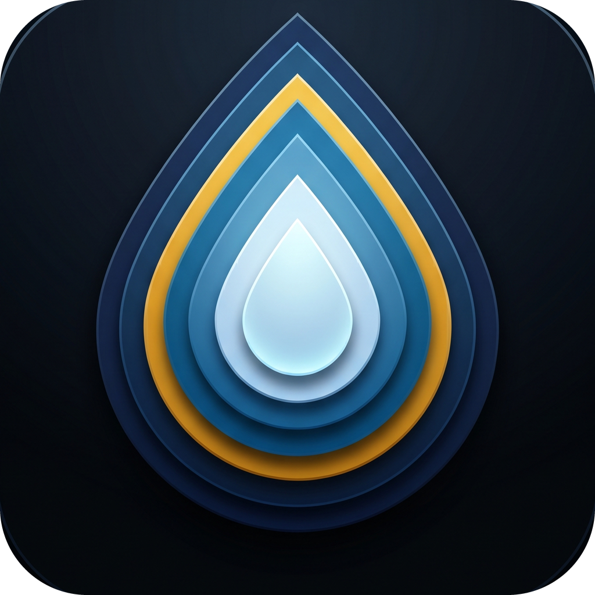

<!-- SPDX-License-Identifier: AGPL-3.0-or-later -->

<p align="center"></p>

# OpenH2O — Open Water Accounting Platform

**A production-ready water accounting platform that a California water agency can stand up on a $15/month server — with an AI agent doing the deployment.**

OpenH2O tracks groundwater extraction, surface-water diversions, mixed-use accounting, and managed aquifer recharge, and prepares the state compliance reports (GEARS and CalWATRS) that California agencies have to file. It is built on a fully open stack so that any agency — or any engineering firm working on their behalf — can run it, read it, and improve it.

> **Live demo:** [openh2o.com](https://openh2o.com) · **License:** [AGPL-3.0-or-later](#license) · **Deploy guide:** [DEPLOY.md](DEPLOY.md) · **Deploy it with an AI:** [docs/AI-OPERATOR-GUIDE.md](docs/AI-OPERATOR-GUIDE.md)

---

## Who this is for

California's **Sustainable Groundwater Management Act (SGMA)** requires hundreds of local **Groundwater Sustainability Agencies (GSAs)** and water districts to measure and report how much water their basins use. Most of these agencies are small, underfunded, and have no software staff. The existing tooling is excellent but expensive — a typical setup runs **$35,000–$75,000** in consulting, and effectively every deployment is vendor-managed.

OpenH2O exists to change the cost structure. The core idea is simple:

> **Access is the product, not features.** An under-resourced agency buys a frontier-AI subscription, points the AI at this repository and a cheap virtual server, and the AI stands the whole platform up. No procurement cycle, no consulting contract.

It is designed for a single agency per deployment (single-tenant), and it works whether your basin is groundwater-only, surface-water-only, mixed-use, or doing active recharge.

### A note on terms
- **GSA** — Groundwater Sustainability Agency, the local body responsible for a basin under SGMA.
- **GEARS / CalWATRS** — the State Water Resources Control Board's reporting systems. OpenH2O *prepares* the filings (as CSV) that a certifying official then submits; it does not auto-submit, because the state has no submission API and the filings are certified under penalty of perjury.
- **OpenET** — a satellite-derived estimate of evapotranspiration (how much water crops and land consume), used here to estimate consumptive use.

---

## Three ways to deploy

| Path | Who it's for | Start here |
|------|--------------|------------|
| **AI-operated** | An agency with no software staff, using a frontier AI agent | [docs/AI-OPERATOR-GUIDE.md](docs/AI-OPERATOR-GUIDE.md) |
| **Manual deploy** | An ops person or consultant on a fresh Linux server | [DEPLOY.md](DEPLOY.md) |
| **Local trial** | Anyone who wants to see it running on their laptop first | [Quick start](#quick-start-local-trial) below |

### Quick start (local trial)

```bash
git clone https://github.com/Open-H2O/openh2o.git
cd openh2o
cp .env.example .env                 # set SECRET_KEY at minimum
docker compose up -d --build         # start db + web + caddy
docker compose exec web python manage.py migrate
docker compose exec web python manage.py seed_data      # reference data
docker compose exec web python manage.py seed_demo_data # a fictional example agency
```

Open `http://localhost`. You'll land on a fully populated demo agency ("Demo Valley GSA"). Run `make help` for all shortcuts. For a real deployment with HTTPS, a domain, scheduled data sync, and production hardening, follow [DEPLOY.md](DEPLOY.md).

---

## What it does

- **Parcels and wells** with real spatial data (GeoDjango + PostGIS) — boundaries, points of diversion, well inventories.
- **A double-entry water accounting ledger** that tracks supply, usage, and allocations by water type and zone — the same accounting discipline a bank uses, applied to acre-feet.
- **Surface-water rights** with points of diversion and diversion records, including curtailment.
- **Managed aquifer recharge** site and event tracking.
- **External data sync** from seven public sources — USGS, CDEC, DWR (Water Data Library and SGMA portal), CIMIS, NOAA, CNRFC — plus OpenET satellite evapotranspiration, all crosswalked to a single canonical vocabulary (see [Data standards](#data-standards--interoperability)).
- **State report preparation** — GEARS (by-well and by-ET) and CalWATRS (direct-use and to-storage) as ready-to-file CSV.
- **Standards-based publishing** — the data model is built to publish out as OGC SensorThings, Frictionless Data Packages, and WaDE 2.0 (see below).
- **Health monitoring** dashboard with source-aware freshness, plus interactive dark-mode maps via MapLibre GL JS.

---

## Data standards & interoperability

This is the part most worth a careful look. OpenH2O is **born-compliant**: every measurement it stores or ingests is mapped to a single canonical vocabulary, so it can publish to open standards without per-agency remapping.

- A **canonical ObservedProperty registry** maps every measured concept (stream discharge, depth-to-groundwater, ET, reservoir storage, …) to its **USGS parameter code**, **EPA WQX characteristic name**, and **UCUM unit**.
- A **SourceParameter crosswalk** maps each external source's native parameter codes onto that canonical vocabulary, so USGS code `00060`, CDEC code `20`, and a CNRFC streamflow forecast all resolve to the same `discharge` concept.
- Measurements carry **quality flags** (provisional / approved / estimated) and groundwater wells carry a **vertical datum** (NAVD88 / NGVD29), both following OGC SensorThings conventions.
- A **conformance gate** (`check_conformance`) refuses to let incomplete data reach a publish path.

The full crosswalk, the standards roadmap (OGC SensorThings API, Frictionless, WaDE 2.0), and a machine-readable export live in **[docs/DATA-STANDARDS.md](docs/DATA-STANDARDS.md)**. If you run another district's system, this is the part you can reuse directly.

---

## Tech stack

| Component | Technology | Why |
|-----------|------------|-----|
| Framework | Django 5 + GeoDjango | Batteries-included, spatial-aware, one language |
| Database | PostgreSQL 16 + PostGIS 3.4 | The open-source standard for spatial data |
| Frontend | HTMX + Tailwind (standalone binary) | No Node.js toolchain to maintain |
| Maps | MapLibre GL JS | Open vector maps, no API keys |
| Reverse proxy | Caddy | Automatic HTTPS with near-zero config |
| Background work | Django management commands + cron | No Celery/Redis; fits 2–4 GB RAM |
| Packaging | Docker Compose | One command to start everything |

Deliberate non-goals: **no Node.js build step, no Celery/Redis, no multi-tenancy.** The platform is meant to run comfortably on the smallest practical server.

---

## Repository layout

```
openh2o/
  config/        Django project + settings (base / local / production)
  core/          User model, roles, site config, seed commands
  geography/     GSA boundaries, management zones, basin codes
  parcels/       Parcel registry and the accounting ledger
  wells/         Well inventory and meters
  measurements/  Meter readings, sensors, quality flags
  accounting/    Water accounts, allocations, reporting periods
  surface/       Surface-water rights, points of diversion, diversions
  recharge/      Managed aquifer recharge sites and events
  infrastructure/ Unified CRUD for wells, PODs, recharge sites
  datasync/      External data adapters (7 sources + OpenET)
  reporting/     GEARS and CalWATRS report generators
  standards/     Canonical vocabulary, crosswalk, conformance gate
  health/        System health checks and data pruning
  templates/     Django templates (HTMX partials)
  static/        Design tokens, compiled CSS, map toolkit
  tests/         pytest suite (factory_boy fixtures)
  docs/          Deployment, AI operator, data standards, and tier guides
```

## Cost to run

| Item | Typical cost |
|------|--------------|
| Virtual server (2–4 GB RAM) | $15–30 / month |
| Domain name | ~$12 / year |
| OpenET (satellite ET) | Free tier for small agencies; Earth Engine batch tier $0–200/yr for thousands of parcels (see [docs/earth-engine-tier-setup.md](docs/earth-engine-tier-setup.md)) |
| Transactional email (password resets) | Free tier covers most agencies |
| CIMIS / NOAA / CDEC / USGS / DWR data | Free (public APIs) |

A small agency can realistically run OpenH2O for **under $25/month all-in.**

## Testing

```bash
make test     # pytest, pinned to local settings
```

The suite uses pytest + pytest-django + factory_boy and lives in [tests/](tests/). Production settings intentionally refuse to boot without a strong database password and a real `ALLOWED_HOSTS`, which is why the test target pins `--ds=config.settings.local`.

## Contributing

Issues and pull requests are welcome — see [CONTRIBUTING.md](CONTRIBUTING.md). Because the platform is AGPL-licensed, contributions are made under the same terms.

## License

OpenH2O is licensed under the **GNU Affero General Public License, version 3 or later (AGPL-3.0-or-later)** — see [LICENSE](LICENSE) and [NOTICE](NOTICE).

The AGPL is the strongest open-source guarantee for networked software. Its **Section 13** means that if you run a modified version of OpenH2O and let people use it over a network, you must offer those users the source code to your modified version. In practice: any agency or vendor that improves OpenH2O and hosts it has to share those improvements back. That is intentional — it keeps the platform, and everything built on it, in the commons.

## Acknowledgments

OpenH2O is an independent, clean-room reimplementation on an open stack. It descends conceptually from the **Groundwater Accounting Platform** stewarded by the **California Water Data Consortium** (the independent nonprofit founded in 2019 to carry out AB 1755) and developed by **ESA (formerly Sitka Technology Group)**, which is likewise released under the AGPL. We are grateful for that prior art. No ESA/Sitka source code is included here.

Built by Brent Vanderburgh for the water managers of California.
