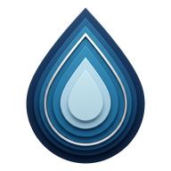
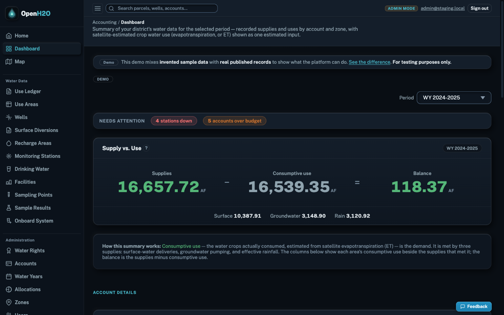
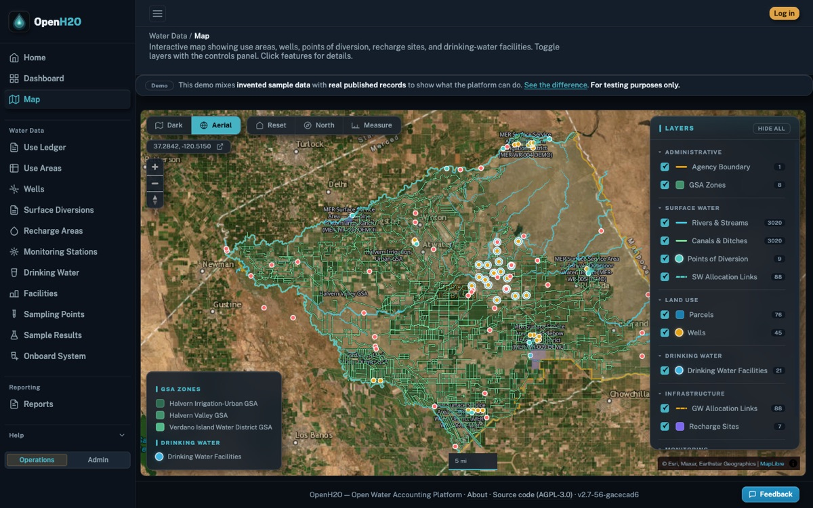
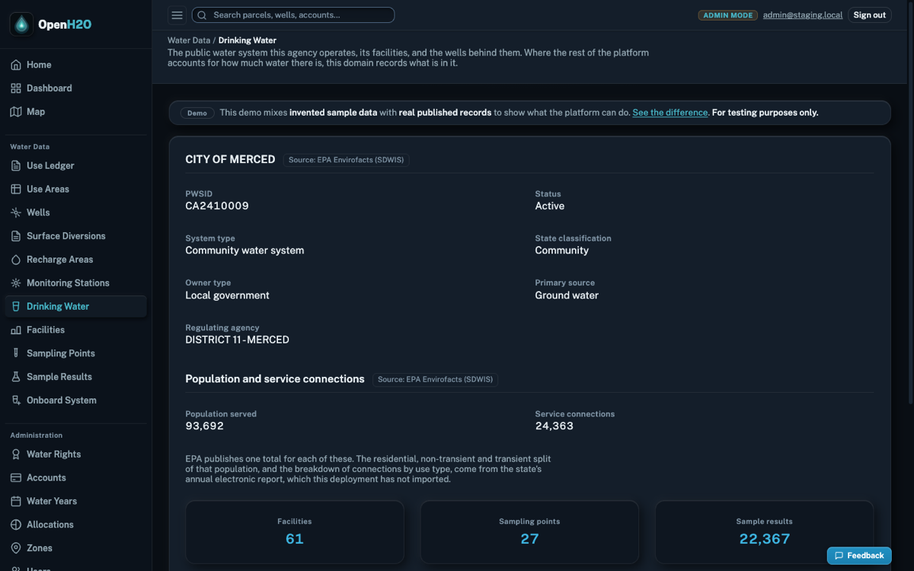

<!-- SPDX-License-Identifier: AGPL-3.0-or-later -->

<p align="center"></p>

# OpenH2O — Open Water Accounting Platform

**A production-ready water-data management platform that a California water agency can stand up wherever it already has a computer — an office machine, a $15/month rented server, or agency infrastructure — with an AI agent doing the deployment.**

OpenH2O helps a water agency manage its own water data — the measurements, deliveries, wells, diversions, recharge, and drinking-water quality records that make up an agency's files — so the agency owns and understands its own basin. Satellite evapotranspiration (ET) is one of those data feeds, not the centerpiece. For agencies that also file with the state, it can prepare the reports (GEARS and CalWATRS), but reporting is an optional add-on, not the reason the platform exists. It is built on a fully open stack so that any agency — or any engineering firm working on their behalf — can run it, read it, and improve it.

> **Live demo:** [openh2o.com](https://openh2o.com) · **License:** [AGPL-3.0-or-later](#license) · **Deploy guide:** [DEPLOY.md](DEPLOY.md) · **Deploy it with an AI:** [docs/AI-OPERATOR-GUIDE.md](docs/AI-OPERATOR-GUIDE.md)

---

## Who this is for

California's **Sustainable Groundwater Management Act (SGMA)** requires hundreds of local **Groundwater Sustainability Agencies (GSAs)** and water districts to account for the water their basins use. Most of these agencies are small, underfunded, and have no software staff. The existing tooling is excellent but expensive, and effectively every deployment is vendor-managed.

OpenH2O exists to change the cost structure. The core idea is simple:

<!-- defines: repository -->
> **The goal is to lower the cost and access barrier.** An under-resourced agency can stand the platform up itself — point a frontier-AI agent at this *repository* (a folder holding all of the program's files, kept on a website called GitHub with a complete history of every change ever made to it) and at a cheap rented computer, and the agent does the deployment, with no procurement cycle to wait on. An engineering firm or consultant can run it just as well, and for many agencies that is the sensible path; the point is that self-deployment is now a real option, not a vendor contract by default.

It is designed for a single agency per deployment (single-tenant), and it works whether your basin is surface-water, groundwater, mixed-use, or doing active recharge.

### A note on terms
- **GSA** — Groundwater Sustainability Agency, the local body responsible for a basin under SGMA.
- **GEARS / CalWATRS** — the State Water Resources Control Board's reporting systems. OpenH2O *prepares* the filings (as CSV) that a certifying official then submits; it does not auto-submit, because the state has no submission API and the filings are certified under penalty of perjury.
- **OpenET** — a satellite-derived estimate of evapotranspiration (how much water crops and land consume), used here to estimate consumptive use.

---

## Three ways to deploy

| Path | Who it's for | Start here |
|------|--------------|------------|
| **AI-operated** | An agency with no software staff, using a frontier AI agent | [docs/AI-OPERATOR-GUIDE.md](docs/AI-OPERATOR-GUIDE.md) |
| **Manual deploy** | An ops person or consultant on a fresh Linux server | [DEPLOY.md](DEPLOY.md) |
| **Single computer** | An agency running it on one office machine or a laptop — a supported deployment, not a preview | [Quick start](#quick-start-single-computer) below |

**None of these is a lesser deployment.** What changes between them is who needs
to reach the instance: only the machine it runs on, an office network, or the
public internet. Only the last needs a domain name and encryption.

<!-- defines: tls_https -->
*HTTPS* is the padlock-icon, encrypted version of a web address, and the padlock
rests on a *certificate* — a file that proves the address really is itself. A
deployment nobody outside the building can reach has no address to prove and
needs neither, and going without is a supported posture here rather than a
corner cut.

<!-- defines: docker -->
**All three assume Docker, and you do not have to.** OpenH2O normally ships as
three *containers*: a container is a sealed, pre-packed box holding one piece of
the program plus everything it needs to run, so it behaves the same on any
computer, and Docker is the software that builds and runs those boxes. Any of
the three paths can instead install the pieces directly onto the machine — a
legitimate first choice, and the only option when the machine's own host will
not allow those boxes at all. The whole path is in
[docs/INSTALL-WITHOUT-DOCKER.md](docs/INSTALL-WITHOUT-DOCKER.md).

**What a brand-new installation contains, and what it does not.** It holds none
of your agency's own water records, and that is what the setup guide expects,
not a step that went wrong. A fresh install starts empty and the first thing
anyone loads into it is the Merced Subbasin demonstration — a real, published
California basin, labelled as the demonstration everywhere it appears, there so
that the platform has something to show while you work out how to get your own
records in. Replacing it with your agency's own basin is the normal next step.
So if a brand-new install shows you Merced's wells, canals and parcels, nothing
has failed: you are looking at exactly what a brand-new install holds.

### Quick start (single computer)

```bash
git clone https://github.com/Open-H2O/openh2o.git
cd openh2o
cp .env.example .env
# For a quick look on your own machine, set these two lines in .env:
#   SECRET_KEY=<any-random-string>             # base settings require it, no default
#   DJANGO_SETTINGS_MODULE=config.settings.local   # dev mode: DEBUG on, dev DB password is fine
#
# WARNING: config.settings.local is for LOOKING AT IT, not for holding an
# agency's real records. DEBUG=True prints the site's internals on any error
# page, and it defaults ALLOWED_HOSTS to "*" if you set none. To actually
# run your agency on one computer, use production settings with the three
# plain-HTTP flips - see docs/AI-OPERATOR-GUIDE.md Phase 2.
docker compose up -d --build         # start db + web + caddy
docker compose exec web python manage.py migrate
docker compose exec web python manage.py seed_data      # reference data
docker compose exec web python manage.py seed_merced    # the Merced Subbasin demonstration
docker compose exec web python manage.py createsuperuser   # your login for the trial
```

<!-- defines: localhost -->
<!-- defines: superuser -->
Open `http://localhost` — that word and `127.0.0.1` both mean "this same
computer," as opposed to an address anyone else could type — and log in with the
*superuser* you just created. A superuser is the one account inside OpenH2O that
can do anything: add other staff accounts, change settings, see everything. It
is separate from and unrelated to any login for the computer itself, it has to
be created by hand before anyone can sign in at all, and there is no "first
visitor becomes the administrator" magic. Most pages sit behind a login, and
self-signup is closed by default on a fresh install (that's the
`ACCESS_CONTROL_ENFORCED` setting; the public demo at openh2o.com runs with it
off).

<!-- defines: seed_data -->
You'll land on the **Merced Subbasin** demonstration — a real California basin,
the same one running at [openh2o.com](https://openh2o.com). *Seeding* means
loading a starting set of data into the empty database, either small reference
lists such as units and categories or a whole demonstration dataset. The seed
here fetches live hydrography and monitoring stations from public government
services (a few-minute wait, no key required), and the demonstration's water
rights, deliveries, parcels and ledger activity are all seeded and internally
coherent without any key.

**Consumptive-use figures are the exception: they are computed from satellite ET, so without an OpenET key those numbers stay empty.** Add an OpenET key to fill them in. `run_calculations` also needs a calculation method in place first, which `seed_calculation_plan` creates and no other seed command runs for you — the demonstration seed ends by listing whatever is still missing, and that list is the thing to follow. Run `make help` for all shortcuts. For a real deployment with encryption, a domain, scheduled data sync, and production hardening, follow [DEPLOY.md](DEPLOY.md).

---

## The AI agent's role doesn't end at setup

For an agency with no software staff, a capable coding agent (Claude Code or similar) is not just a one-time installer — it's the ongoing operator and translator between the agency and the platform.

- **It onboards your existing records.** Point the agent at the data you already have — a county assessor parcel export, a stack of spreadsheets, a dump from an old system — and it works out how your columns map onto OpenH2O's importers and loads them. The import tools are built for this: field-name overrides, a dry-run that validates before writing anything, and a staging table so a bad file never half-corrupts your data. The agent handles the data crosswalking you'd otherwise need a developer for. See [docs/DATA-IMPORT.md](docs/DATA-IMPORT.md).
- **It runs the routine work.** Monthly data sync, pruning dead monitoring stations, preparing the GEARS and CalWATRS filings, reading the health check — the agent can do these on a schedule and explain what each number means.
- **It troubleshoots.** When something breaks, the agent reads the logs and the deploy guide and fixes it, rather than the agency waiting on a vendor support ticket.

The deployment is the first thing the agent does, not the only thing. [docs/AI-OPERATOR-GUIDE.md](docs/AI-OPERATOR-GUIDE.md) walks an agent through the whole arc.

---

## What it looks like

All three are the live demo at [openh2o.com](https://openh2o.com), running the
Merced Subbasin dataset. Rows marked *Demo* are invented sample data shown
beside real published records — the platform labels which is which rather than
blurring them.

**The accounting dashboard** — supplies, consumptive use, and the balance
between them for the selected water year, with what needs attention on top:



**The map**, which is public on the demo — agency boundary, GSA zones, rivers
and canals, parcels, wells, points of diversion, recharge sites and
drinking-water facilities, each an independent layer:



**The drinking-water module** — a public water system keyed to its EPA PWSID,
with every figure carrying the source that published it:



---

## What it does

<!-- defines: postgis -->
- **Parcels and wells** with real spatial data — boundaries, points of diversion, well inventories. All of it lives in *PostgreSQL*, the database program that stores every record the site shows, with the *PostGIS* add-on that teaches it to understand maps, boundaries and points on a map.
- **A water-data ledger** that records supply, usage, and allocations by water type and zone, so every entry is traceable.
- **Surface-water rights** with points of diversion and diversion records, including curtailment.
- **Managed aquifer recharge** site and event tracking.
- **Drinking-water quality** — water systems, facilities, and sampling points keyed to their EPA PWSID, a lab-results importer for California DDW exports, and a PWSID-driven onboarding wizard that prefills a system from public records. Quality and quantity live side by side in one instance.
- **External data sync** from public sources. USGS, CDEC and DWR (Water Data Library and SGMA portal) are switched on and need no credentials. CIMIS and NOAA are switched on too but stay idle until you supply a free API key — a long password-like string that lets this program, rather than a person, fetch data automatically from another organisation's computers, treated as a secret exactly like a password. CNRFC and OpenET satellite evapotranspiration ship switched off, ready to enable; OpenET also needs a key. Everything is crosswalked to a single canonical vocabulary (see [Data standards](#data-standards--interoperability)). <!-- defines: api_key -->
- **State report preparation** — GEARS (by-well and by-ET) and CalWATRS (direct-use and to-storage) as ready-to-file CSV.
- **Standards-based publishing** — the data model is built to publish out as OGC SensorThings, Frictionless Data Packages, and WaDE 2.0 (see below).
- **Health monitoring** dashboard with source-aware freshness, plus interactive maps via MapLibre GL JS — aerial imagery by default, with a dark basemap a click away.
- **In-app feedback (optional, off by default)** — a built-in widget can let users file bugs, ideas, and questions (with screenshots and automatic diagnostics) without leaving the app; reports are stored locally and can optionally forward to a triage pipeline. Enable it with `FEEDBACK_ENABLED=True` on a deployment that has someone to read the reports.

---

## Data standards & interoperability

This is the part most worth a careful look. OpenH2O is **born-compliant** — standards-*interoperable* by design, not a claim of SGMA compliance: every measurement it stores or ingests is mapped to a single canonical vocabulary, so it can publish to open data standards without per-agency remapping.

- A **canonical ObservedProperty registry** maps every measured concept (stream discharge, depth-to-groundwater, ET, reservoir storage, …) to its **USGS parameter code**, **EPA WQX characteristic name**, and **UCUM unit**.
- A **SourceParameter crosswalk** maps each external source's native parameter codes onto that canonical vocabulary, so USGS code `00060`, CDEC code `20`, and a CNRFC streamflow forecast all resolve to the same `discharge` concept.
- Measurements carry **quality flags** (provisional / approved / estimated) and groundwater wells carry a **vertical datum** (NAVD88 / NGVD29), both following OGC SensorThings conventions.
- A **conformance audit** (`check_conformance`) reports every measurement that is not fully publishable — a missing unit, a missing crosswalk entry — and exits non-zero when it finds one, so a script can gate on it. It is run by hand; nothing calls it automatically, and there is no live publish path for it to sit in front of yet.

The full crosswalk, the standards roadmap (OGC SensorThings API, Frictionless, WaDE 2.0), and a machine-readable export live in **[docs/DATA-STANDARDS.md](docs/DATA-STANDARDS.md)**. If you run another district's system, this is the part you can reuse directly.

---

## Tech stack

<!-- defines: reverse_proxy -->
<!-- defines: cron -->
<!-- defines: docker_compose -->
Three of the names in this table are pieces an operator actually meets, so they
are worth a sentence each. **Caddy** is a *reverse proxy* — a middleman program
that receives the traffic arriving from outside and relays it inward to the real
program — and here it also obtains the encryption certificate by itself.
***cron*** is Linux's built-in scheduler: "run this command every night at 2am,"
a task the computer performs on a repeating clock with nobody there to click a
button. **Docker Compose** is a helper tool, installed alongside Docker, that
starts, stops and rebuilds all three boxes together from one instruction file
(`docker-compose.yml`) instead of doing each by hand.

| Component | Technology | Why |
|-----------|------------|-----|
| Framework | Django 5 + GeoDjango | Batteries-included, spatial-aware, one language |
| Database | PostgreSQL 16 + PostGIS 3.4 | The open-source standard for spatial data |
| Frontend | HTMX + Tailwind (standalone binary) | No Node.js toolchain to maintain |
| Maps | MapLibre GL JS | Open vector maps, no API keys |
| Reverse proxy | Caddy | Automatic HTTPS with near-zero config |
| Background work | Django management commands + cron | No Celery/Redis; fits 2–4 GB RAM |
| Packaging | Docker Compose | One command to start everything |

Deliberate non-goals: **no Node.js build step, no Celery/Redis, no multi-tenancy.** The platform is meant to run comfortably on the smallest practical server.

---

## Repository layout

```
openh2o/
  config/        Django project + settings (base / local / production)
  core/          User model, roles, site config, seed commands
  geography/     GSA boundaries, management zones, basin codes
  parcels/       Parcel registry and the accounting ledger
  wells/         Well inventory and meters
  measurements/  Meter readings, sensors, quality flags
  accounting/    Water accounts, allocations, reporting periods
  surface/       Surface-water rights, points of diversion, diversions
  recharge/      Managed aquifer recharge sites and events
  drinking/      Drinking-water systems, facilities, sampling points, lab results
  infrastructure/ Unified CRUD for wells, PODs, recharge sites
  datasync/      External data adapters (7 sources + OpenET)
  setup/         First-run setup wizard (watershed, sources, imports)
  reporting/     GEARS and CalWATRS report generators
  standards/     Canonical vocabulary, crosswalk, conformance gate
  health/        System health checks and data pruning
  feedback/      In-app feedback widget intake (stores + optional forward)
  templates/     Django templates (HTMX partials)
  static/        Design tokens, compiled CSS, map toolkit
  tests/         pytest suite (factory_boy fixtures)
  docs/          Deployment, AI operator, data standards, and tier guides
```

## Cost to run

<!-- defines: google_earth_engine -->
<!-- defines: smtp -->
Two rows below name something that is not obvious. **Google Earth Engine** is a
separate, heavier-duty Google service for processing satellite imagery at large
scale; an agency may hold a key for it without ever needing it at their size.
**Transactional email** is the plumbing that lets a website send outgoing mail —
here, "you forgot your password" messages — through an outside mail provider
instead of pretending to be its own mail server, and **SMTP** is simply the
agreed method for handing each message over.

| Item | Typical cost |
|------|--------------|
| Virtual server (2–4 GB RAM) | $15–30 / month |
| Domain name | ~$12 / year |
| OpenET (satellite ET) | Free tier for small agencies; Earth Engine batch tier $0–200/yr for thousands of parcels (see [docs/earth-engine-tier-setup.md](docs/earth-engine-tier-setup.md)) |
| Transactional email (password resets) | Free tier covers most agencies |
| CIMIS / NOAA / CDEC / USGS / DWR data | Free (public APIs) |

## Testing

```bash
make test     # pytest, pinned to local settings
```

<!-- defines: allowed_hosts -->
The suite uses pytest + pytest-django + factory_boy and lives in [tests/](tests/). Production settings intentionally refuse to boot on an empty or well-known-default database password, or without a real `ALLOWED_HOSTS` — the safety list of web addresses the site will answer to, which stops a stranger tricking it into behaving as a different website. That refusal is deliberate, and it is why the test target pins `--ds=config.settings.local`.

## Contributing

Issues and pull requests are welcome — see [CONTRIBUTING.md](CONTRIBUTING.md). Because the platform is AGPL-licensed, contributions are made under the same terms.

## License

OpenH2O is licensed under the **GNU Affero General Public License, version 3 or later (AGPL-3.0-or-later)** — see [LICENSE](LICENSE) and [NOTICE](NOTICE).

The AGPL is the strongest open-source guarantee for networked software. Its **Section 13** means that if you run a modified version of OpenH2O and let people use it over a network, you must offer those users the source code to your modified version. In practice: any agency or vendor that improves OpenH2O and hosts it has to share those improvements back. That is intentional — it keeps the platform, and everything built on it, in the commons.

## Acknowledgments

OpenH2O builds on earlier work. The idea — and much of the accounting methodology — comes from the **Groundwater Accounting Platform**, an open-source system created by **ESA (formerly Sitka Technology Group)** and stewarded by the **California Water Data Consortium**, the nonprofit set up in 2019 to open up California's water data. That platform is also released under the AGPL.

OpenH2O is an independent rebuild on a fully open stack: we studied how that platform works and reimplemented it from scratch, so none of their code is copied here — but we're grateful for the path they cleared.
